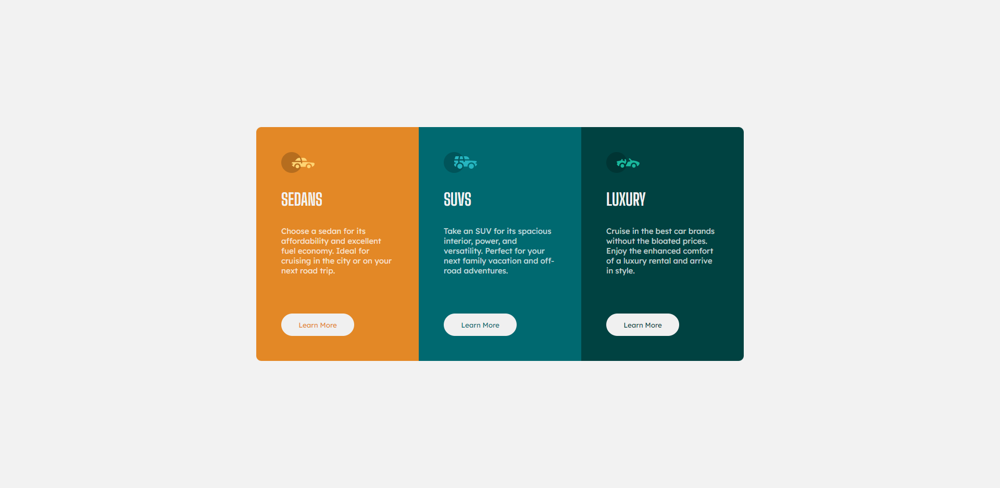

# Frontend Mentor - 3-column preview card component solution

This is a solution to the [3-column preview card component challenge on Frontend Mentor](https://www.frontendmentor.io/challenges/3column-preview-card-component-pH92eAR2-). Frontend Mentor challenges help you improve your coding skills by building realistic projects. 

## Table of contents

- [Overview](#overview)
  - [The challenge](#the-challenge)
  - [Screenshot](#screenshot)
  - [Links](#links)
- [My process](#my-process)
  - [Built with](#built-with)
  - [Continued development](#continued-development)
- [Author](#author)

## Overview

### The challenge

Users should be able to:

- View the optimal layout depending on their device's screen size
- See hover states for interactive elements

### Screenshot

### Links

- Solution URL: [https://github.com/davinceey/fmProj7]
- Live Site URL: [Add live site URL here](https://your-live-site-url.com)

## My process
 Made use of CSS responsive units such as the rem, em, CSS Grid and Flexbox.

### Built with

- Semantic HTML5 markup
- CSS custom properties
- Flexbox
- CSS Grid

### Continued development
Still working towards perfection in ensuring that I create and build responsive layouts and projects.

## Author

- Frontend Mentor - [@davinceey](https://www.frontendmentor.io/profile/davinceey)
